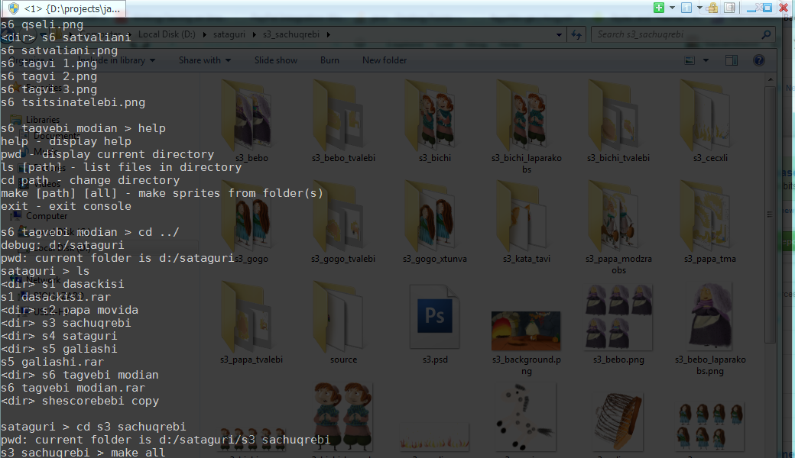

1. Place scene contents in folder [some_scene_folder].
2. Group sprite images in folders inside [some_cene_folder]. for example: ./[some_scene_folder]/[some_character_images], ./[some_scene_folder]/[some_other_character_images], ...
3. Run this sprite tool.
4. Inside sprite console 'cd [some_scene_folder]'
5. Inside sprite console 'make all'
6. You will see as a result generated sprite images in [some_scen_folder] as [some_character_images].png, [some_other_character_images].png or if some sprite exceeds optimal sprite size in this case 1024x1024 you will see [some_character_images]_1.png, [some_character_images]_2.png,...,[some_character_images]_n.png

* Make sure that sprite images inside sprite folder have same width and height.

